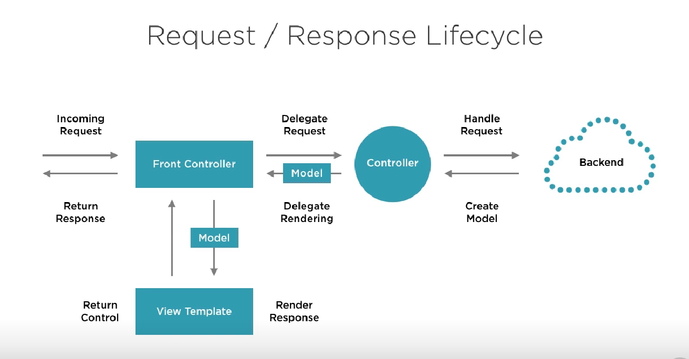
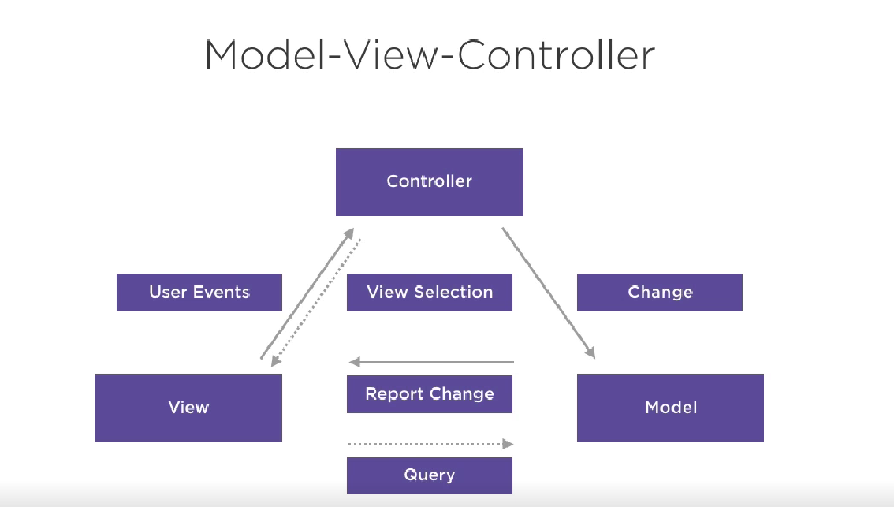
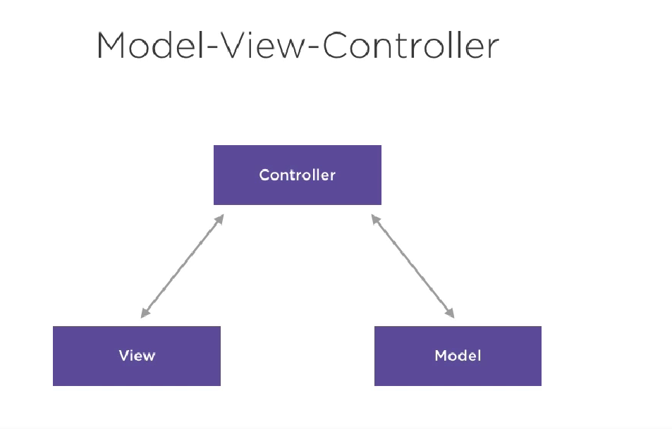
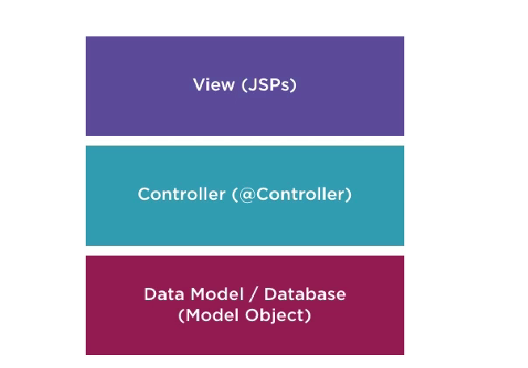

## Conference Web Application—Spring MVC

### Req/Res cycle

- Incoming request is first processed by front controller( dispatcher servlet)
- The dispatcher routes the request to one of the controllers,
- The controller delegates this req traffic to backend
- backend could be web services, databases; it creates a model (kind of view to be rendered)
- Now this rendering of model is separate from business logic, this model is passed to view template( view resolver) to render
- req of view is returned to front controller & returned to browser.

### Spring MVC configuration

- pom.xml: handle all dependencies
- config : defines all the configurations
- Java : Java configurations
- View: the web pages that render in browser

### Spring MVC Configurations

- SpringBootServletInitializer
  - This helps up the launch-up application with desired configuration such as jsp, html
  - The packaging of application to be `war` & it reduces burn to quickly wire up views

- SpringBootServletInitializer looks for jsp/index pages & the extension for those
    - `spring.mvc.view.prefix=/WEB-INF/views/
        spring.mvc.view.suffix=.jsp`

- Wire up this jsp page to some controller say greeting at `@GetMapping("greeting")`

### MVC Structure

- The request comes through View by some user Events 
- The Controller handles this view & routes the respective Model & select View based on user events
- The model gets updated in the database/backend
- This uses absorber & subscriber listener design pattern

#### MCV Updated version

- 
- The MVC Structure is based on an MVC design pattern
- The view can access the model through the controller 
- We make lightweight req from view to an access model through controller
- View doesn't go directly to db to fetch

#### Application Layers

- Data Layer
    - At the bottom we have a data model, which can be JDBC, Hibernate, JPA. This layer represents data or model of application 
- Controller Layer
  - Which interprets user request & select the appropriate view based on user request
- View Layer
  - The web page through which user actions are performed such as jsp, thymeleaf, html

  
### Spring Components 

- Spring provides components with respect to mvc architecture, `controller`, `service`, `repository`
- ##### Controller Tier
  - Which routes the incoming traffic to get user-specific view  
  - **Business logic should not be handled here**
  - This tier should coordinate with service & repository
  - Annotated with `@Component` 
  - Handle user exceptions & view routing
- ##### Service Tier
  - **The business should reside in this tier**
  - Ensure business object state, all state management should be handled 
  - Transactions should begin, such as access web service, roll back 2 face commits
  - Annotated with `@Service`
-  ##### Repository tier 
   - also referred as DAO(Data Access Object)
   - Service tier describes the actions we want to do & repo tier tell data that we are going to interact with CRUD operations
   - one to one with objects
   - one to one or one to many or many to many table
   - Annotated with `@Repository`

### Interceptors

- Interceptors allow us to intercept calls to our servers & perform common tasks on server
- common Interceptors are `Logging` useful for debugging, security, performance monitoring

### Application using Thymeleaf

- Thymeleaf is a light weight spring view resolver 
- In case of JSP, we don't have to create a template engine, just need the view resolver
- But in case of Thymeleaf, we have to create a template resolver along with template engine 
- This template engine helps process page & substitute the model value in pages
- The view Resolver takes up the template loaded by template resolver using template engine